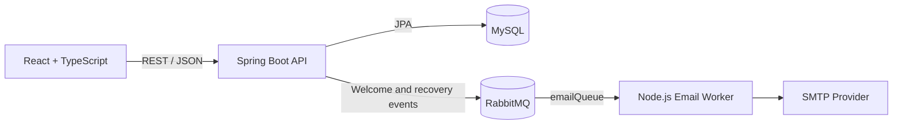

# SkillLink

Full-stack platform for sharing projects, skills, mentorships, events, challenges, and learning opportunities, built with React and Spring Boot.

[](backend/pom.xml)
[](backend/pom.xml)
[](frontend/package.json)
[](frontend/package.json)
[](.github/workflows/ci.yml)

## About

SkillLink brings several community-learning workflows into one application. Learners and mentors can build skill-based profiles, publish and discover projects, create challenges, organize events, offer mentorships, and find people with overlapping interests.

The repository demonstrates a stateless REST API, relational persistence, asynchronous messaging, security boundaries, a typed React client, containerized local infrastructure, and automated quality checks without turning the project into an oversized enterprise system.

## Features

- Account registration, BCrypt password hashing, JWT login, and password recovery
- Authenticated user accounts, profiles, skills, and experience levels
- Skill-overlap recommendations between user profiles
- Project CRUD, search, and technology associations
- Event CRUD, search, and event registrations
- Mentorship CRUD and category associations
- Challenge CRUD and search
- Asynchronous welcome and password-recovery emails through RabbitMQ
- Protected frontend routes with loading and error states for API-backed views
- Health endpoints for the API and email worker

Course screens currently contain presentation data and should not be interpreted as a complete API-backed course-management module.

## Architecture



The API is layered into controllers, DTOs, services, repositories, entities, mappers, security, and messaging. Email delivery is asynchronous: the backend publishes an event, RabbitMQ buffers it, and the email worker acknowledges it after processing. See [the architecture notes](docs/architecture.md) for runtime behavior and current boundaries.

## Tech Stack

### Frontend

React 19, TypeScript, Vite, React Router, Tailwind CSS, Framer Motion, and ESLint.

### Backend

Java 17, Spring Boot 3.5, Spring Web, Spring Security, Spring Data JPA, Bean Validation, Actuator, ModelMapper, Maven, and Auth0 Java JWT.

### Database and messaging

MySQL 8 and RabbitMQ. The email worker uses Node.js, Express, Nodemailer, Handlebars templates, and `amqplib`.

### Tooling and deployment

Docker, Docker Compose, Nginx, Postman, npm, Maven Wrapper, and GitHub Actions.

## Project Structure

```text
skilllink/
├── backend/                 # Spring Boot REST API
│   ├── src/main/java/       # Layered application code
│   └── src/test/            # Context, security, and service tests
├── frontend/                # React + TypeScript client
├── email/                   # RabbitMQ email worker
├── docs/                    # Architecture notes and real screenshots
├── .github/workflows/       # CI pipeline
└── docker-compose.yml       # Local full-stack environment
```

## Getting Started

### Prerequisites

For the recommended setup, install Docker with Docker Compose v2. For manual development, use Java 17 and Node.js 22; MySQL 8 and RabbitMQ must also be reachable.

### Full stack with Docker

```bash
cp .env.example .env
docker compose up --build
```

Then open:

- Frontend: `http://localhost:5173`
- API health: `http://localhost:8081/actuator/health`
- RabbitMQ management: `http://localhost:15672`
- Email worker health: `http://localhost:5000/health`

The checked-in credentials are development defaults only. Set `EMAIL_USER` and `EMAIL_PASS` in `.env` to enable email delivery.

### Backend

Start MySQL and RabbitMQ, then:

```bash
cd backend
cp .env.example .env
set -a
source .env
set +a
./mvnw spring-boot:run
```

The local default uses Hibernate `update` to initialize the development schema. Use a controlled migration strategy and set `JPA_DDL_AUTO=validate` in production.

### Frontend

```bash
cd frontend
cp .env.example .env
npm ci
npm run dev
```

### Email Service

```bash
cd email
cp .env.example .env
npm ci
npm run dev
```

## Environment Variables

| Variable | Component | Purpose |
| --- | --- | --- |
| `DB_URL` | Backend | MySQL JDBC URL |
| `DB_USERNAME`, `DB_PASSWORD` | Backend | Database credentials |
| `JWT_SECRET` | Backend | HMAC signing secret; use at least 32 random characters |
| `PASSWORD_RESET_SECRET` | Backend | Separate HMAC secret for password-reset tokens |
| `JWT_EXPIRATION_MINUTES` | Backend | Authentication token lifetime; default `180` |
| `CORS_ALLOWED_ORIGINS` | Backend | Comma-separated trusted frontend origins |
| `RABBITMQ_HOST`, `RABBITMQ_PORT` | Backend | Broker location |
| `RABBITMQ_USERNAME`, `RABBITMQ_PASSWORD` | Backend | Broker credentials |
| `RABBITMQ_VIRTUAL_HOST`, `RABBITMQ_SSL_ENABLED` | Backend | Broker virtual host and TLS mode |
| `JPA_DDL_AUTO`, `JPA_SHOW_SQL` | Backend | Schema and SQL logging behavior |
| `VITE_API_URL` | Frontend | Public base URL of the backend, without `/api` |
| `CLOUDAMQP_URL` | Email | AMQP connection URI |
| `EMAIL_USER`, `EMAIL_PASS` | Email | SMTP account credentials |
| `FRONTEND_URL` | Email | Base URL used in password-reset links |
| `RABBITMQ_QUEUE`, `RABBITMQ_RETRY_DELAY_MS` | Email | Queue name and reconnect delay |

Use the `.env.example` files as templates. Real `.env` files are ignored by Git.

## API Documentation

Import [`backend/SkillLink.postman_collection.json`](backend/SkillLink.postman_collection.json) into Postman and set its `url` collection variable to `http://localhost:8081/`. Authenticate with `POST /api/ingresar`, copy the returned JWT into the collection's secret `token` variable, and use it for protected endpoints.

Representative routes:

| Method | Route | Purpose |
| --- | --- | --- |
| `POST` | `/api/registro` | Register an account |
| `POST` | `/api/ingresar` | Issue a JWT |
| `GET` | `/api/perfil/mi-cuenta` | Read the authenticated profile |
| `GET`, `POST` | `/api/proyectos` | List or create projects |
| `GET`, `POST` | `/api/desafios` | List or create challenges |
| `GET` | `/evento` | List events |
| `POST` | `/registro-evento` | Register for an event |
| `GET` | `/mentoria` | List mentorships |
| `GET` | `/actuator/health` | Check API health |

## Testing

```bash
# Backend: 7 focused/context tests
cd backend && ./mvnw verify

# Frontend
cd frontend && npm run lint && npm run build

# Email worker
cd email && npm test
```

CI runs these checks on pushes to `main` and on pull requests. The backend Docker build also runs `mvn verify` before producing its runtime image.

## Deployment

Each application has a production-oriented multi-stage or minimal Dockerfile, and the frontend image serves the Vite build through Nginx with SPA fallback. Deployment is intentionally not automated until a stable hosting target and verified URLs exist.

The Git remote still uses `SkillLink---Jedi`. Renaming the repository to `skilllink-platform` is recommended, but should be coordinated with Git remotes, badges, and any external deployment settings. A suitable GitHub description is:

> Full-stack platform for sharing projects, skills, mentorships, events, and learning opportunities using React, Spring Boot, MySQL, and RabbitMQ.

Suggested topics: `react`, `typescript`, `spring-boot`, `java`, `mysql`, `rabbitmq`, `full-stack`, `rest-api`, `jwt`, `education`, `mentorship`, `vite`.

## Security

- Passwords are encoded with BCrypt and are excluded from JSON serialization.
- Authentication and password-reset JWTs are signed, expiring, purpose-separated, and rejected safely when malformed.
- Public endpoints are explicitly allow-listed; all other API routes require authentication.
- Project and challenge writes enforce ownership using the authenticated user rather than a client-provided user ID.
- Password recovery returns the same response whether or not an account exists.
- CORS origins and all infrastructure credentials are environment-driven.
- Actuator exposes only health/info and does not reveal health details.

Previously committed database, RabbitMQ, and JWT credentials must be rotated because removing them from the current file does not remove them from Git history.

The current browser client stores its JWT in `localStorage`. A production deployment should evaluate short-lived tokens in secure, HttpOnly cookies and add rate limiting to authentication and recovery endpoints.

## Screenshots

The repository includes one real [home-page screenshot](docs/screenshots/home.png). Add verified dashboard, project, and profile captures under `docs/screenshots/` as those views are finalized; placeholder images are intentionally not included.

## Contributors

SkillLink was developed collaboratively. See the [GitHub contributors graph](https://github.com/dierez00/SkillLink---Jedi/graphs/contributors) for the commit history.

## License

No open-source license has been declared yet. Until a license is added, the repository remains under default copyright terms.
