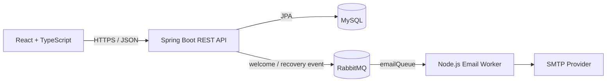

# Architecture

SkillLink is a monorepo with three independently runnable applications. The React client calls a stateless Spring Boot REST API. The API persists domain data in MySQL and publishes email commands to RabbitMQ. The Node.js email worker consumes those commands and delivers welcome or password-recovery messages through the configured SMTP account.

## Runtime behavior

- Authentication is stateless. The API issues a signed JWT after login and protected requests send it as a Bearer token.
- Passwords are hashed with BCrypt before persistence.
- The email queue is durable and the worker acknowledges a message only after processing it. Failed deliveries are requeued; connection failures trigger a delayed reconnect.
- Actuator exposes only `health` and `info`; health details are not returned publicly.

## Known boundaries

- MySQL is the source of truth; the project does not currently include database migrations or seed data.
- The email flow is asynchronous, so API success means the message was accepted by RabbitMQ rather than delivered by the SMTP provider.
- Course-oriented screens in the frontend currently use static presentation data. They are not documented as API-backed learning management features.
- Environments that already have a non-durable `emailQueue` must recreate it once before deploying this durable-queue configuration.
